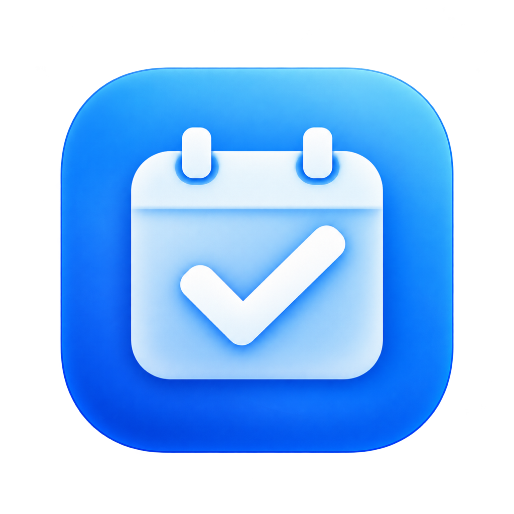

<p align="center">
  
</p>

<h1 align="center">Daydo</h1>

<p align="center">把每天要做的事，放在一起。</p>
<p align="center">原生 macOS 待办 · 日历 · 桌面小组件 · Agent MCP</p>
<p align="center">
  <a href="https://github.com/jiangxiaolin1995/Daydo/releases">下载与版本记录</a> ·
  <a href="#agent--mcp">连接 Agent</a> ·
  <a href="#从源码运行">从源码运行</a> ·
  <a href="https://github.com/jiangxiaolin1995/Daydo/issues">反馈问题</a>
</p>

Daydo 是一个用 SwiftUI 构建的 Mac 待办应用。打开即可使用，无需注册或登录 Daydo。
你可以自己记录任务，也可以让 Codex、Claude Code 等 Agent 通过本地 MCP 帮你新增、编辑和完成待办。

## 下载与安装

最低支持 **macOS 14 Sonoma**。当前版本为 **1.0.0 Beta 2**（构建号 2），安装包同时包含 Apple Silicon 和 Intel 架构。

[**下载 DMG 安装包**](https://github.com/jiangxiaolin1995/Daydo/releases/download/v1.0.0-beta.2/Daydo-1.0.0-beta.2-universal.dmg) · [SHA-256 校验文件](https://github.com/jiangxiaolin1995/Daydo/releases/download/v1.0.0-beta.2/SHA256SUMS.txt) · [版本说明](https://github.com/jiangxiaolin1995/Daydo/releases/tag/v1.0.0-beta.2)

应用与小组件使用 Developer ID Application 签名；应用和 DMG 均已通过 Apple 公证并装订票据。
**当前为预览版，iCloud 跨设备同步等场景仍在验证中**，具体限制见下文和版本说明。

1. 下载 `Daydo-1.0.0-beta.2-universal.dmg`。
2. 打开 DMG，把 `Daydo.app` 拖到 `Applications`。
3. 从「应用程序」打开 Daydo，开始记录任务。
4. 需要提醒时，在「设置 → 通用」允许通知；需要小组件时，按下方说明添加。

升级前可在「设置 → 数据」导出 JSON 备份。替换应用不会主动删除任务；更新后请让已连接的 Agent 重新连接 MCP。

## 可以做什么

| 功能 | 说明 |
| --- | --- |
| 清单 | 创建、重命名、设置颜色、排序和归档，归档保留任务 |
| 每日任务 | 收集箱、今天、未来、已完成和已删除；搜索、撤销与快捷键 |
| 任务详情 | 标题、备注、清单、计划日期、开始时间、时长、优先级、重复与提醒 |
| 日历 | 日／周／月视图，全天任务与时间安排分开展示 |
| 重复任务 | 每天、工作日、每周指定星期；每次发生单独完成，可编辑一次或这次及以后 |
| 桌面小组件 | 小／中／大尺寸，显示当日任务，勾选完成，点击标题打开详情 |
| 本地 MCP | Agent 通过标准输入／输出访问同一套任务数据，无需开放网络端口 |
| History 自动整理 | 内置可复制提示词，让 Codex 定时整理活动记录并创建明确的日期计划 |
| 备份 | 版本化 JSON 导出、导入预览、按稳定 ID 去重，保留已有修改 |

没有日期的任务进入收集箱；只有日期的任务显示在全天区域；过期未完成的任务在「今天」中单独展示，原计划日期保持不变。时间以 15 分钟为单位，默认时长 30 分钟，日历默认周一开始。

关闭最后一个窗口后，Daydo 会隐藏 Dock 图标并留在菜单栏，继续处理同步和提醒。点击菜单栏的圆形对号可重新打开应用；最小化保留 Dock 入口。Agent 在后台新增、编辑或完成任务不会再次弹出窗口。可在设置中开启开机启动，界面跟随系统浅色／深色外观。

## iCloud 与数据

任务先保存在本机的 App Group 数据空间。iCloud 使用 **Mac 系统账户**，不需要单独登录 Daydo；未启用 iCloud 时也能本机使用。开启同步时，应用会提示将本机任务合并到当前系统账户。

**iCloud 同步仍在验证中。** 当前开发设备遇到 CloudKit 私有数据库访问错误，尚未取得跨设备同步成功的证据；请保留 JSON 备份，不要把本机保存成功理解为云端已同步。系统账户变化时，应用会隔离数据空间。

应用、小组件和 MCP 共用任务模型及存储操作。MCP 不监听 HTTP 端口，但接入的 Agent 可以读写任务，因此应只向信任的客户端配置连接。

## Agent / MCP

先启动 Daydo 一次，然后打开 **设置 → Agent**，点击「复制通用 MCP 配置」。这里生成的路径与当前安装位置一致。

安装在 `/Applications` 时，可使用以下配置：

```json
{
  "mcpServers": {
    "daydo": {
      "command": "/Applications/Daydo.app/Contents/MacOS/Daydo",
      "args": ["--mcp"]
    }
  }
}
```

Codex CLI：

```sh
codex mcp add daydo -- /Applications/Daydo.app/Contents/MacOS/Daydo --mcp
```

Claude Code：

```sh
claude mcp add --transport stdio --scope user daydo -- /Applications/Daydo.app/Contents/MacOS/Daydo --mcp
```

如果安装在用户目录或其他位置，请使用设置中复制的实际路径。示例配置也在 [Configuration](Configuration)。

### 可用工具

| 工具 | 用途 |
| --- | --- |
| `get_status` | 检查可用状态、同步状态与时区 |
| `list_lists`、`create_list`、`update_list` | 查询、新建和编辑清单 |
| `list_tasks`、`get_task` | 按清单、日期、完成状态查询任务 |
| `create_task`、`update_task` | 新增和编辑任务，包括备注、时间、优先级、重复与提醒 |
| `set_task_completion` | 明确设为完成或未完成；重复任务指定发生实例 |

可以直接向已接入的 Agent 说：

> 帮我新建一条明天上午 9 点喝水的任务。
>
> 把周报安排到周五下午 3 点，优先级设为高，提前 15 分钟提醒。

客户端应先调用 `get_status` 并检查 `ready`。创建支持 `requestId` 去重，编辑需要当前 `expectedRevision`；成功后回读结果。日期使用 `YYYY-MM-DD`，时区使用 IANA 标识。重复实例使用 `taskId + occurrenceDay`，完成操作设置明确的 `completed` 状态。

### 每 10 分钟整理 Computer History

1. 打开 **设置 → Agent → History 自动整理**。
2. 点击 **复制自动整理提示词**，粘贴发给 Codex。
3. Codex 检查 Computer History、MCP 和定时任务能力，复用或创建每 10 分钟运行的自动任务，并先执行一轮核对。

提示词包含增量摘要、日期和优先级判断、任务去重、来源备注、创建后回读，以及无变化时保持安静。只有能核实为用户本人提出或接受、尚未完成、日期可确定的计划才会写入 Daydo。

这个定时流程运行在 **Codex** 中，需要该环境具备 Computer History 和定时任务能力。Daydo 只提供提示词与 MCP；设备休眠、离线或 History 摘要延迟可能影响执行时间。

## 桌面小组件与快捷键

正常启动 Daydo 一次后，在桌面右键 →「编辑小组件」，搜索 Daydo，选择尺寸。
勾选圆圈会在后台完成任务；点击标题打开任务详情，并复用主窗口。系统负责小组件刷新调度，刚修改的内容可能稍后显示。

| 快捷键 | 操作 |
| --- | --- |
| `⌘N` | 新建任务 |
| `⌘F` | 搜索任务 |
| `⌘↩` | 完成选中任务 |
| `⌘Z` | 撤销上一步 |

## 从源码运行

需要 Xcode 26、Swift 6、[XcodeGen](https://github.com/yonaskolb/XcodeGen)，以及具备相应能力的 Apple Developer 团队。

```sh
git clone https://github.com/jiangxiaolin1995/Daydo.git
cd Daydo
./script/build_and_run.sh --verify
```

脚本构建应用与小组件，更新 `~/Applications/Daydo.app`，并检查应用进程。支持 `--build`（仅构建）、`--preview`（独立演示数据）、`--debug`、`--logs`。开发预览不访问真实任务、MCP、小组件或 iCloud。

使用自己的开发者团队时，需要同步调整：

- `project.yml`：团队、Bundle ID、App Group、CloudKit 容器。
- `Sources/DaydoCore/SharedEnvironment.swift`：相同的标识。
- Apple Developer 中对应的 App ID、App Group、CloudKit 和推送能力。
- `Configuration/ExportOptions.plist`：用于公开分发的团队。

`project.yml` 是 Xcode 项目的配置来源。修改后运行 `xcodegen generate`。Debug 使用 CloudKit Development，Release 使用 Production；生产环境部署和双机同步需要另行验证。

公开发行采用 Developer ID、Apple 公证与 DMG，操作步骤见 [发布说明](docs/RELEASING.md)。

### 测试

```sh
swift test --jobs 4
python3 script/check_widget_intent.py "$HOME/Applications/Daydo.app"
```

45 项测试覆盖日期、重复实例、提醒、删除恢复、请求去重、并发版本检查、备份、跨进程历史及窗口与 Dock 状态。核心测试使用临时数据。真实界面、小组件和 iCloud 的验证状态见 [项目方案](docs/PLAN.md)。

### 项目结构

```text
App/                 应用入口、窗口与菜单栏
Views/               SwiftUI 主界面、日历与设置
Sources/DaydoCore/    模型、重复规则、存储与共享任务操作
Sources/DaydoDesktop/ 菜单栏图标与窗口、Dock 行为
Services/            同步、提醒与应用状态
MCP/                 官方 Swift MCP SDK 的 stdio 服务
Widget/、Shared/     WidgetKit 与完成任务 App Intent
Tests/               业务与窗口回归测试
Configuration/       权限、Info.plist、MCP 与分发配置
script/              构建、验证与打包入口
Assets/              应用图标与资源
```

## 当前验证范围

主应用、本地 MCP 和中号小组件已在开发 Mac 验证，核心测试通过。以下项目仍需补齐：Intel Mac 实机、macOS 14 实机、双机 iCloud 同步、小号／大号小组件、跨午夜刷新，以及部分日历拖动和通知场景。Claude Code 已识别工具，但模型驱动的完整流程尚未验证。

如遇问题，请在 [Issues](https://github.com/jiangxiaolin1995/Daydo/issues) 中提供 macOS 版本、芯片型号、Daydo 版本和复现步骤；不要上传个人任务备份或账户凭据。

Daydo 使用系统原生组件，视觉参考 HeroUI。应用图标由 AI 生成。主要依赖为 [Swift MCP SDK](https://github.com/modelcontextprotocol/swift-sdk) 和 Apple Swift 开源库；依赖许可见 [THIRD_PARTY_NOTICES.txt](THIRD_PARTY_NOTICES.txt)。
